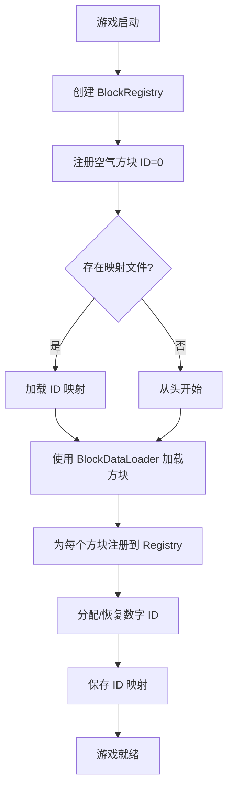

# 方块注册表系统设计文档

## 🎯 设计目标

解决以下关键问题：
1. **模组冲突** - 不同模组可能有同名方块
2. **性能优化** - 游戏运行时需要快速查询
3. **存档兼容** - 更新游戏/模组后存档不应损坏
4. **调试友好** - 开发时易于理解和调试

---

## 🏗️ 核心架构

### 1. NamespacedId（命名空间 ID）

**作用：** 唯一标识方块，支持模组扩展

```csharp
public readonly struct NamespacedId
{
    public string Namespace { get; }  // 模组 ID
    public string Path { get; }       // 方块名称
    public string FullId { get; }     // 完整ID："namespace:path"
}
```

**示例：**
```csharp
// 内置方块
new NamespacedId("stone")                // → "voxelpath:stone"
new NamespacedId("voxelpath:dirt")       // → "voxelpath:dirt"

// 模组方块
new NamespacedId("techmod:copper_ore")   // → "techmod:copper_ore"
new NamespacedId("magicmod:copper_ore")  // → "magicmod:copper_ore"

// 子路径支持
new NamespacedId("decoration/lamp")      // → "voxelpath:decoration/lamp"
```

**设计要点：**
- ✅ 使用 `struct` 减少堆分配
- ✅ 实现 `IEquatable<NamespacedId>` 支持高效比较
- ✅ 格式验证：仅允许 `[a-z0-9_/:]`
- ✅ 隐式转换为字符串，方便使用

---

### 2. BlockRegistry（方块注册表）

**作用：** 管理方块注册、查询和持久化

#### 存储结构

```csharp
public class BlockRegistry
{
    // 核心映射（三向绑定）
    Dictionary<NamespacedId, int> _nameToId;      // 名称 → 数字ID
    Dictionary<int, NamespacedId> _idToName;      // 数字ID → 名称
    Dictionary<int, BlockData> _idToData;         // 数字ID → 方块数据
    
    // 索引优化
    Dictionary<string, List<int>> _namespaceIndex; // 按命名空间索引
    
    // ID 分配器
    int _nextId = 1;  // 0 保留给空气
}
```

#### 为什么使用数字 ID？

虽然我们有 `NamespacedId`，但游戏运行时使用**数字 ID**有巨大优势：

| 方面 | NamespacedId（字符串） | 数字 ID |
|------|----------------------|---------|
| **内存占用** | ~40 字节（字符串对象） | 4 字节（int32） |
| **查询速度** | O(n) 字符串比较 | O(1) 数组索引 |
| **网络传输** | 变长，至少10字节 | 4字节固定 |
| **调试友好** | ✅ 可读性强 | ❌ 需要查表 |
| **模组兼容** | ✅ 不冲突 | ⚠️ 需要映射管理 |

**最佳实践：**
```csharp
// ❌ 不推荐：游戏逻辑中直接使用字符串
if (blockName == "voxelpath:stone") { ... }

// ✅ 推荐：启动时转换为数字 ID
var stoneId = registry.GetNumericId(new NamespacedId("stone"));
if (blockId == stoneId) { ... }

// ✅ 更好：使用常量缓存
public static class BlockIds {
    public static readonly int Stone = registry.GetNumericId(new NamespacedId("stone"));
}
```

---

## 🔄 工作流程

### 启动时流程



### 注册流程

```csharp
// 1. 加载方块数据
var blocks = await loader.LoadAllBlocksAsync(...);

// 2. 为每个方块创建 NamespacedId
foreach (var block in blocks)
{
    var nsId = new NamespacedId(block.Name);
    
    // 3. 注册到 Registry（自动分配数字 ID）
    var numericId = registry.Register(nsId, block);
    
    // 4. BlockData.Id 被自动设置
    Debug.Assert(block.Id == numericId);
}

// 5. 保存 ID 映射（用于下次启动）
registry.SaveMappings("user://block_mappings.json");
```

---

## 💡 关键特性

### 1. 模组冲突处理

**问题：** 两个模组都有铜矿

```json
// techmod/copper_ore.json
{
  "name": "copper_ore",
  "display_name": "铜矿石"
}

// magicmod/copper_ore.json
{
  "name": "copper_ore",
  "display_name": "铜矿石"
}
```

**解决方案：**
```csharp
// 注册时指定命名空间
var techCopper = new NamespacedId("techmod:copper_ore");
var magicCopper = new NamespacedId("magicmod:copper_ore");

registry.Register(techCopper, techCopperData);   // ID: 100
registry.Register(magicCopper, magicCopperData); // ID: 101

// 两者不冲突！
```

### 2. 存档兼容性

**问题：** 更新游戏后，方块 ID 可能变化导致存档损坏

```
旧版本: stone → ID 5
新版本: stone → ID 8  // 糟糕！所有石头都变成了其他方块！
```

**解决方案：**
```json
// user://block_mappings.json
{
  "version": "1.0",
  "next_id": 150,
  "mappings": {
    "voxelpath:stone": 5,
    "voxelpath:dirt": 6,
    "techmod:copper_ore": 100
  }
}
```

启动时加载此文件，保证 ID 稳定性：
```csharp
registry.LoadMappings("user://block_mappings.json");
// stone 仍然是 ID 5，不会变！
```

### 3. 命名空间管理

查询特定模组的所有方块：
```csharp
// 获取所有已加载的模组
var namespaces = registry.GetNamespaces();
// ["voxelpath", "techmod", "magicmod"]

// 获取某个模组的所有方块
var techBlocks = registry.GetBlocksInNamespace("techmod");
// [copper_ore, iron_ore, machine_frame, ...]
```

### 4. 多种查询方式

```csharp
// 方式 1：数字 ID（最快，推荐用于游戏逻辑）
var block = registry.GetById(5);

// 方式 2：NamespacedId（清晰，推荐用于初始化）
var block = registry.GetByNamespacedId(new NamespacedId("stone"));

// 方式 3：字符串（方便，推荐用于配置/调试）
var block = registry.GetByString("voxelpath:stone");

// 方式 4：双向查询
var numericId = registry.GetNumericId(new NamespacedId("stone"));
var namespacedId = registry.GetNamespacedId(5);
```

---

## 📊 性能分析

### 内存占用估算

假设注册 1000 个方块：

```
NamespacedId 存储（字典键）:
  - 1000 × ~40 字节 = ~40 KB

数字 ID 映射（字典）:
  - 1000 × (4 + 8) 字节 = ~12 KB

BlockData 引用（字典）:
  - 1000 × 8 字节 = ~8 KB

命名空间索引:
  - ~10 个命名空间 × ~1 KB = ~10 KB

总计: ~70 KB (可忽略不计)
```

### 查询性能

| 操作 | 时间复杂度 | 实际耗时(估算) |
|------|-----------|---------------|
| `GetById(int)` | O(1) | ~10 ns |
| `GetByNamespacedId(nsId)` | O(1) | ~50 ns |
| `GetByString(string)` | O(1) + 解析 | ~200 ns |
| `Register(nsId, data)` | O(1) | ~1 μs |

---

## 🧪 测试覆盖

### 单元测试

```csharp
BlockRegistryTests.cs
├─ TestNamespacedId           // NamespacedId 创建、相等性、格式验证
├─ TestBasicRegistration      // 注册、查询、重复处理
├─ TestModConflict            // 模组冲突场景
├─ TestQueryMethods           // 所有查询方法
├─ TestPersistence            // 保存/加载映射
├─ TestValidation             // 完整性检查
└─ TestIntegrationWithLoader  // 与加载器集成
```

### 集成测试

```csharp
// 完整流程测试
var loader = new BlockDataLoader();
var registry = new BlockRegistry();

// 1. 加载
var blocks = await loader.LoadAllBlocksAsync(...);

// 2. 注册
foreach (var block in blocks) {
    registry.Register(new NamespacedId(block.Name), block);
}

// 3. 验证
registry.ValidateIntegrity();

// 4. 持久化
registry.SaveMappings(...);
```

---

## 🚀 使用示例

### 基本用法

```csharp
// 1. 创建注册表
var registry = new BlockRegistry();
AddChild(registry); // Godot Node

// 2. 注册方块
var stone = BlockData.CreateSimple("stone", "石头", "res://textures/stone.png");
var stoneId = new NamespacedId("stone");
var numericId = registry.Register(stoneId, stone);

// 3. 查询方块
var block = registry.GetById(numericId);
GD.Print($"Found: {block.DisplayName}");

// 4. 保存映射
registry.SaveMappings("user://mappings.json");
```

### 模组支持

```csharp
// 模组 A
var modACopper = new NamespacedId("mod_a:copper_ore");
registry.Register(modACopper, copperDataA);

// 模组 B
var modBCopper = new NamespacedId("mod_b:copper_ore");
registry.Register(modBCopper, copperDataB);

// 获取所有铜矿（跨模组）
var allBlocks = new List<BlockData>();
foreach (var ns in registry.GetNamespaces()) {
    var blocks = registry.GetBlocksInNamespace(ns);
    allBlocks.AddRange(blocks.Where(b => b.Name.Contains("copper")));
}
```

### 与加载器集成

```csharp
public class BlockManager : Node
{
    private BlockDataLoader _loader;
    private BlockRegistry _registry;
    
    public async void Initialize()
    {
        _loader = new BlockDataLoader();
        _registry = new BlockRegistry();
        
        AddChild(_loader);
        AddChild(_registry);
        
        // 1. 尝试加载已有映射
        _registry.LoadMappings("user://block_mappings.json");
        
        // 2. 加载方块数据
        var blocks = await _loader.LoadAllBlocksAsync(
            "res://Data/blocks/_manifest.json"
        );
        
        // 3. 注册所有方块
        foreach (var block in blocks)
        {
            var nsId = new NamespacedId(block.Name);
            _registry.Register(nsId, block);
        }
        
        // 4. 保存映射（用于下次启动）
        _registry.SaveMappings("user://block_mappings.json");
        
        // 5. 验证完整性
        _registry.ValidateIntegrity();
        
        // 6. 打印统计
        _registry.PrintRegistry();
    }
}
```

---

## 🔮 未来扩展

### 1. BlockStateRegistry（下一步）

```csharp
public class BlockStateRegistry
{
    // State ID = Block ID + State Properties Hash
    Dictionary<int, BlockState> _stateIdToState;
    Dictionary<(int blockId, int propertiesHash), int> _stateCache;
    
    // 笛卡尔积生成所有状态组合
    void GenerateStates(BlockData block);
}
```

### 2. 运行时重新映射

```csharp
// 处理存档加载时的 ID 冲突
public class IdRemapper
{
    // 旧存档: stone → 5, 新游戏: stone → 8
    // 需要建立映射: 5 → 8
    Dictionary<int, int> _oldToNew;
    
    public int Remap(int oldId);
}
```

### 3. 分布式 ID 分配

```csharp
// 为不同类型预留 ID 范围
const int BLOCK_ID_START = 0;
const int BLOCK_ID_END = 10000;
const int ITEM_ID_START = 10000;
const int ITEM_ID_END = 20000;
const int ENTITY_ID_START = 20000;
```

---

## 📚 相关文档

- `NamespacedId.cs` - 命名空间 ID 实现
- `IBlockRegistry.cs` - 注册表接口
- `BlockRegistry.cs` - 注册表实现
- `BlockRegistryTests.cs` - 单元测试
- `BlockRegistryExample.cs` - 使用示例

---

## 🎓 设计原则总结

1. **命名空间隔离** - 避免模组冲突
2. **双层 ID 系统** - NamespacedId（可读）+ 数字 ID（性能）
3. **持久化映射** - 保证存档兼容性
4. **类型安全** - 使用 struct 和强类型
5. **性能优先** - 字典 O(1) 查询，无装箱
6. **调试友好** - 完善的日志和验证工具

---

**设计者**: GitHub Copilot  
**日期**: 2025-12-04  
**版本**: 1.0
