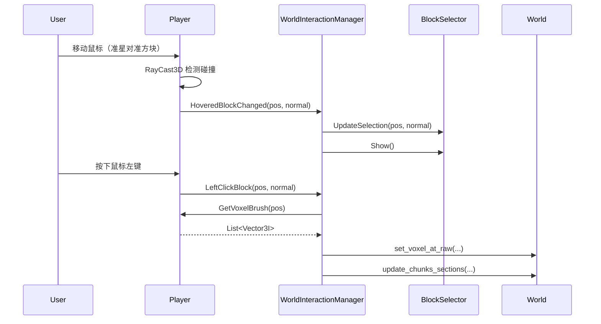

# 玩家交互系统 (Player Interaction System)

本文档介绍了基于事件的玩家-世界交互系统。该系统旨在将玩家的输入和射线检测与具体的交互逻辑（如方块高亮、方块行为等）解耦。

## 核心设计理念

### 职责分离 (Separation of Concerns)

系统采用**事件驱动架构**，将交互流程拆分为三个独立的组件：

1. **Player（事件发射器）**：只负责检测用户输入和射线碰撞，不关心具体交互逻辑
2. **WorldInteractionManager（协调中心）**：监听事件并执行默认交互行为（破坏/放置方块）
3. **BlockSelector（视觉反馈）**：纯粹的显示组件，被动接收指令

### 架构优势

- ✅ **高内聚低耦合**：各组件职责清晰，互不依赖具体实现
- ✅ **易于扩展**：新增方块行为无需修改核心代码
- ✅ **便于测试**：可以独立测试每个组件
- ✅ **符合 SOLID 原则**：开闭原则、单一职责原则

---

## 系统组件

### 1. Player 类（事件发射器）

`Player` 类提供以下事件：

```csharp
// 射线检测事件
public event Action<Vector3I, Vector3> HoveredBlockChanged;  // 准星指向新方块
public event Action HoveredBlockExited;                       // 准星离开方块

// 交互事件
public event Action<Vector3I, Vector3> LeftClickBlock;        // 左键点击方块
public event Action<Vector3I, Vector3> RightClickBlock;       // 右键点击方块

// 笔刷事件
public event Action<int> BrushSizeChanged;                    // 笔刷大小改变
```

**事件参数说明**：
- `Vector3I blockPosition`: 方块的网格坐标
- `Vector3 blockNormal`: 碰撞面的法线方向
- `int brushSize`: 笔刷大小（1/2/4）

**公开属性**：
```csharp
public int BrushSize { get; }                                // 当前笔刷大小
public RayCast3D RayCast { get; }                            // 射线检测器引用
public List<Vector3I> GetVoxelBrush(Vector3I, Vector3?)     // 计算笔刷覆盖的体素
```

**设计原则**：
- Player **不**直接修改方块数据
- Player **不**包含 UI 组件（如 BlockSelector）
- Player **只**负责检测和发射事件

---

### 2. WorldInteractionManager（交互协调中心）

这是系统的核心协调器，负责监听 Player 事件并执行相应操作。

#### 功能职责

1. **监听玩家事件**：订阅 Player 的所有交互事件
2. **控制视觉反馈**：管理 BlockSelector 的显示/隐藏/位置
3. **执行方块操作**：处理方块的破坏和放置逻辑
4. **管理笔刷状态**：同步笔刷大小到 BlockSelector

#### 依赖注入

通过 Godot 的 `[Export]` 特性注入依赖：

```csharp
[Export] private Player _player;
[Export] private BlockSelector _blockSelector;
```

#### 扩展点

可以在事件处理方法中添加自定义逻辑：

```csharp
private void OnHoveredBlockChanged(Vector3I blockPosition, Vector3 blockNormal)
{
    // 1. 获取方块 ID
    int blockId = GetBlockIdAt(blockPosition);
    
    // 2. 根据方块类型分发到不同的行为处理器
    var behavior = BlockBehaviorRegistry.GetBehavior(blockId);
    if (behavior != null)
    {
        behavior.OnPlayerLookAt(blockPosition, blockNormal);
        return;
    }
    
    // 3. 默认行为：显示高亮框
    _blockSelector.UpdateSelection(blockPosition, blockNormal);
    _blockSelector.Show();
}
```

---

### 3. BlockSelector（视觉反馈组件）

纯粹的显示组件，不包含任何逻辑。

#### 公开方法

```csharp
void SetBrushSize(int size)                      // 设置笔刷大小
void UpdateSelection(Vector3I pos, Vector3 norm) // 更新高亮框位置
void Show() / Hide()                             // 显示/隐藏
```

#### 静态工具方法

```csharp
static Vector3I WorldToVoxelIndex(Vector3 worldPos, float voxelSize)
```

---

## 场景设置指南

### 推荐的节点结构

```
Level (主场景)
├── Player (CharacterBody3D)
│   ├── Head (Node3D)
│   │   ├── Camera3D
│   │   └── RayCast3D
│   └── CollisionShape3D
│
├── WorldInteractionManager (Node)
│
└── World (你的世界场景)
    └── BlockSelector (MeshInstance3D)  ← 独立于 Player
```

### 设置步骤

#### 1. 创建 BlockSelector 节点

在 **World** 场景或主场景根节点下（**不是** Player 下）：

1. 添加 `MeshInstance3D` 节点，命名为 `BlockSelector`
2. 附加 `entities/player/scripts/BlockSelector.cs` 脚本
3. 该节点会自动创建立方体网格和半透明材质

#### 2. 创建 WorldInteractionManager 节点

在主场景根节点下：

1. 添加 `Node` 节点，命名为 `WorldInteractionManager`
2. 附加 `systems/WorldInteractionManager.cs` 脚本
3. 在检查器中分配依赖：
   - **Player**: 拖拽 Player 节点
   - **Block Selector**: 拖拽 BlockSelector 节点

#### 3. 配置 Player

确保 Player 节点包含：
- `entities/player/scripts/Player.cs` 脚本
- `PlayerAttribution` 和 `ActionAttribution` 资源
- `Head/Camera3D/RayCast3D` 子节点结构

---

## 扩展示例

### 示例 1：自定义方块行为接口

创建一个接口来定义方块行为：

```csharp
// systems/block_behaviors/IBlockInteractable.cs
namespace VoxelPath.systems.block_behaviors;

public interface IBlockInteractable
{
    void OnPlayerLookAt(Vector3I position, Vector3 normal);
    void OnPlayerLookAway();
    void OnLeftClick(Vector3I position, Vector3 normal);
    void OnRightClick(Vector3I position, Vector3 normal);
}
```

### 示例 2：信息方块处理器

当玩家看向特殊方块时显示信息：

```csharp
// systems/block_behaviors/InformationBlockBehavior.cs
using Godot;
using VoxelPath.systems.block_behaviors;

public partial class InformationBlockBehavior : Node, IBlockInteractable
{
    [Export] private Label _infoLabel;
    
    public void OnPlayerLookAt(Vector3I position, Vector3 normal)
    {
        _infoLabel.Text = $"信息方块位置: {position}";
        _infoLabel.Show();
    }
    
    public void OnPlayerLookAway()
    {
        _infoLabel.Hide();
    }
    
    public void OnLeftClick(Vector3I position, Vector3 normal)
    {
        GD.Print("信息方块不可破坏！");
    }
    
    public void OnRightClick(Vector3I position, Vector3 normal)
    {
        GD.Print("打开信息面板...");
        // 打开 UI 界面
    }
}
```

### 示例 3：方块行为注册表

创建一个注册表来管理方块行为：

```csharp
// systems/block_behaviors/BlockBehaviorRegistry.cs
using System;
using System.Collections.Generic;

namespace VoxelPath.systems.block_behaviors;

public static class BlockBehaviorRegistry
{
    private static Dictionary<int, Type> _behaviors = new();
    
    public static void RegisterBehavior(int blockId, Type behaviorType)
    {
        if (!typeof(IBlockInteractable).IsAssignableFrom(behaviorType))
        {
            throw new ArgumentException($"{behaviorType} must implement IBlockInteractable");
        }
        _behaviors[blockId] = behaviorType;
    }
    
    public static IBlockInteractable GetBehavior(int blockId)
    {
        if (_behaviors.TryGetValue(blockId, out var type))
        {
            return (IBlockInteractable)Activator.CreateInstance(type);
        }
        return null;
    }
}

// 在游戏启动时注册：
BlockBehaviorRegistry.RegisterBehavior(5, typeof(InformationBlockBehavior));
BlockBehaviorRegistry.RegisterBehavior(10, typeof(DoorBlockBehavior));
```

### 示例 4：在 WorldInteractionManager 中使用

修改 `WorldInteractionManager.cs`：

```csharp
private void OnLeftClickBlock(Vector3I blockPosition, Vector3 blockNormal)
{
    // 获取方块 ID
    int blockId = GetBlockIdAt(blockPosition);
    
    // 尝试获取自定义行为
    var behavior = BlockBehaviorRegistry.GetBehavior(blockId);
    if (behavior != null)
    {
        behavior.OnLeftClick(blockPosition, blockNormal);
        return;
    }
    
    // 默认行为：破坏方块
    DestroyVoxels(blockPosition);
}

private int GetBlockIdAt(Vector3I position)
{
    var world = GetTree().CurrentScene;
    if (world.HasMethod("get_voxel_at"))
    {
        return (int)world.Call("get_voxel_at", position);
    }
    return 0; // Air
}
```

---

## 事件流程图



---

## 最佳实践

### ✅ 推荐做法

1. **保持 Player 纯净**：不在 Player 中直接修改游戏状态
2. **使用事件而非直接调用**：组件间通过事件通信，而非相互引用
3. **集中管理交互逻辑**：默认行为放在 WorldInteractionManager
4. **创建独立的行为处理器**：特殊方块行为用独立类实现
5. **及时取消订阅**：在 `_ExitTree()` 中取消事件订阅，防止内存泄漏

### ❌ 避免的做法

1. **不要**在 Player 中引用 BlockSelector
2. **不要**在 Player 中包含方块修改逻辑
3. **不要**让 BlockSelector 监听 Player 事件（应该由 Manager 控制）
4. **不要**在多个地方订阅同一事件做相同的事（容易产生冲突）

---

## 性能优化建议

1. **事件订阅缓存**：避免在 `_Process` 中重复订阅/取消订阅
2. **批量操作**：使用 `BatchModifyVoxels` 批量修改方块，减少网格更新次数
3. **行为对象池**：频繁创建的行为对象可以使用对象池
4. **延迟更新**：使用 `call_deferred` 延迟非紧急的更新操作

---

## 总结

这个事件驱动的交互系统提供了：

- 🎯 **清晰的职责划分**：Player 检测 → Manager 协调 → Selector 显示
- 🔧 **高度的可扩展性**：通过接口和注册表轻松添加新行为
- 🧪 **易于测试维护**：组件独立，易于单元测试
- 📦 **模块化设计**：符合 Godot 节点组合哲学

通过这种架构，您可以轻松实现复杂的方块交互系统，如：
- 可开关的门
- 可激活的机器
- 带 UI 的存储箱
- 流体交互
- 红石般的电路系统

所有这些都无需修改 `Player` 或 `WorldInteractionManager` 的核心代码！

