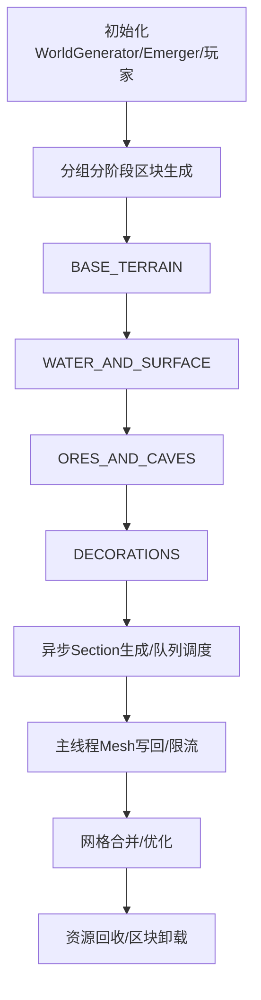

# 世界生成流程与步骤

本项目采用分阶段、异步、优先级调度的体素世界生成体系，核心流程如下：

---

## 1. 初始化阶段
- 加载 `WorldGenerator`，初始化噪声（地形/侵蚀/温度/湿度）、生物群系、方块ID、矿石ID等。
- 初始化 Emerger（区块/Section生成队列管理）、SectionManager（优先级分配）、FluidManager（流体）、玩家控制器等。

## 2. 区块分组分阶段生成
- 玩家进入世界时，优先加载视野范围内的区块。
- 每个区块生成任务拆分为多个 Section（如16x16x16），每个 Section 独立异步生成。
- 区块生成分为多个阶段：
  1. **BASE_TERRAIN**：基础地形（基岩、石头、地形高度）
  2. **WATER_AND_SURFACE**：水体与表层（泥土、草地、沙子、水）
  3. **ORES_AND_CAVES**：矿石与洞穴（可选，当前已屏蔽或简化）
  4. **DECORATIONS**：装饰物（树木、花草等）
- 每个阶段完成后，自动推进下一个阶段，基础地形完成后立即触发后续阶段。

## 3. 任务队列与优先级调度
- Emerger 负责区块/Section生成队列管理，按玩家距离动态分配优先级。
- SectionManager 为每个 Section 分配优先级（HIGH/MEDIUM/LOW），优先处理玩家附近区块。
- 队列限流与动态扩展，防止瞬时爆发导致主线程卡顿。
- 超出队列上限的区块/Section自动延迟入队。

## 4. 异步生成与写回
- 所有 Section 体素数据生成均在后台线程池异步完成，主线程仅负责回写和Mesh生成。
- Section生成完成后，回调 `_on_chunk_section_complete`，推进区块阶段。
- 所有网格（Mesh）写回限流，每帧只处理有限数量，优先玩家视野内区块。

## 5. 网格合并与优化
- 每个 Chunk 只保留地表和水体两个 MeshInstance，所有 Section 网格合并写入，极大减少 DrawCall。
- Mesh生成仅为地表和水体生成Mesh，地下/内部方块跳过，装饰物Mesh合并或延迟生成。
- 远离玩家的区块Mesh自动降级为低细节（LOD）。

## 6. 资源回收与卸载
- 超出视野范围的区块及时卸载，释放Mesh、物理体、体素数据等资源。
- 支持批量回收远离区块，防止内存泄漏。

## 7. 典型流程图

## 8. 关键脚本与模块
- `Scenes/RandomWorld/RandomWorld.gd`：区块管理、分阶段生成、队列调度、Mesh写回、资源回收
- `Scripts/Voxel/world_generator.gd`：地形/水体/矿石/装饰物分阶段生成、噪声、方块ID
- `Scripts/Voxel/emerge_manager.gd`：区块/Section生成队列、限流、优先级调度
- `Scripts/Voxel/section_manager.gd`：Section优先级分配、任务排序
- `Scripts/Voxel/chunk.gd`：体素数据、Mesh生成与合并、物理体

---

> 本流程支持高并发、低延迟、资源自适应的体素世界生成，便于后续扩展LOD、装饰物合并、性能监控等高级特性。
